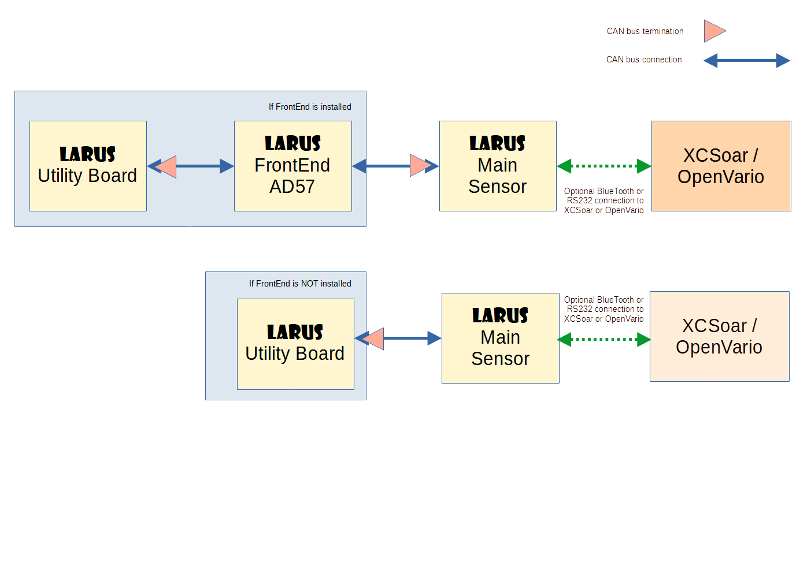

# Overview

Here a little bit more comprehensive overview of this project : <a href="https://github.com/larus-breeze/documentation_and_utilities/blob/master/documentation/Manuals/LARUS_Overview.pdf" title="LARUS Overview ">LARUS Project Overview</a>

# Components and Software

## Central Unit  / Central Sensor
- Processing of all sensor signals, computation of vario signals, computation of AHRS and wind
- https://github.com/larus-breeze/hw_sensor
- https://github.com/larus-breeze/sw_sensor

## Utility Board (comes in 2 flavors : Standard Utility and Horst's Prototype All-In-One-Utility)    
- Blue Pill or F4 based utility module to generate the vario audio sound. Can additionally sense temperature and humidity. Can optionally and additionally handle a flap position sensor, micro switches to detect "gear down" , "brakes out", "flaps above neutral", and a little detached board carrying an array of LEDs to indicate 
- Subsequent documentation and SW refers to the Standard Utility Board.
- https://github.com/larus-breeze/hw_utility
- https://github.com/larus-breeze/sw_utility

## Frontend 
- User interface and system control device based on Air Avionics AD57
- https://github.com/larus-breeze/sw_frontend

